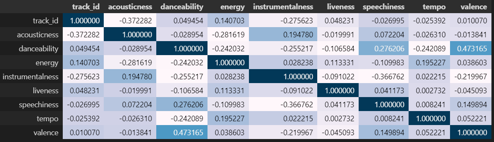
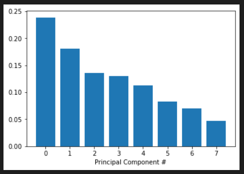
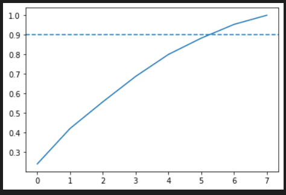

<h3 align='center'>Classify Song Genres from Audio Data<br>Rock or rap?</h3><hr>


<!-- <p align='center'>
  
</p> -->

<h3>1. Préparer notre dataset</h3>
<p>   Au cours des dernières années, les services de streaming avec d'énormes catalogues sont devenus le principal moyen par lequel la plupart des gens écoutent leur musique préférée. Pour cette raison, les services de streaming ont cherché des moyens de catégoriser la musique pour permettre des recommandations personnalisées.

Chargeons les métadonnées sur nos pistes aux côtés des métriques de piste compilées par<b>The Echo Nest</b>.</p>

```python
import pandas as pd

tracks = pd.read_csv('datasets/fma-rock-vs-hiphop.csv')
echonest_metrics = pd.read_json('datasets/echonest-metrics.json', precise_float=True)

# Merge the relevant columns of tracks and echonest_metrics
echo_tracks = pd.merge(echonest_metrics, tracks[['track_id' , 'genre_top']], how='inner', on='track_id')

# Inspect the resultant dataframe
echo_tracks.info()
```
|   Int64Index: 4802 entries, 0 to 4801   |                       |
|:---------------------------------------:|:---------------------:|
|     Data columns (total 10 columns):    |                       |
|               acousticness              | 4802 non-null float64 |
|               danceability              | 4802 non-null float64 |
|                  energy                 | 4802 non-null float64 |
|             instrumentalness            | 4802 non-null float64 |
|                 liveness                | 4802 non-null float64 |
|               speechiness               | 4802 non-null float64 |
|                  tempo                  | 4802 non-null float64 |
|                 track_id                | 4802 non-null int64   |
|                 valence                 | 4802 non-null float64 |
|                genre_top                | 4802 non-null object  |
| dtypes: float64(8), int64(1), object(1) |                       |
|         memory usage: 412.7+ KB         |                       |


<h3>2. Relations par paires entre variables continues</h3>
<p>Nous voulons éviter d'utiliser des variables qui ont de fortes corrélations entre elles - évitant ainsi la redondance des fonctionnalités
Pour savoir s'il existe des fonctionnalités fortement corrélées dans nos données, nous utiliserons des fonctions intégrées dans le<code>pandas</code> package <code>.corr()</code>. </p>

```python
corr_metrics = echo_tracks.corr()
corr_metrics.style.background_gradient()
```
<p align='center'>
  
</p>

<h3>3. Normalisation des données de caractéristiques</h3>
<pÉtant donné que nous n'avons pas trouvé de corrélations fortes particulières entre nos caractéristiques, nous pouvons plutôt utiliser une approche commune pour réduire le nombre de caractéristiques appelée analyse en composantes principales (PCA)
Pour éviter les biais, je normalise d'abord les données à l'aide de la méthode  <code>sklearn</code> built-in <code>StandardScaler</code> method</p>

```python
from sklearn.preprocessing import StandardScaler

features = echo_tracks.drop(['track_id', 'genre_top'], axis=1)
labels = echo_tracks.genre_top

scaler = StandardScaler()
scaled_train_features = scaler.fit_transform(features)
```

<h3>4. Analyse en composantes principales sur nos données à l'échelle</h3>
<p>PCA est maintenant prêt à déterminer de combien nous pouvons réduire la dimensionnalité de nos données. Nous pouvons utiliser des diagrammes d'éboulis et des diagrammes de rapport expliqué cumulatif pour trouver le nombre de composants à utiliser dans des analyses ultérieures.
Lors de l'utilisation de diagrammes d'éboulis, un «coude» (une forte baisse d'un point de données à l'autre) dans le diagramme est généralement utilisé pour décider d'un seuil approprié.</p>
  
```python
from sklearn.decomposition import PCA

pca = PCA()
pca.fit(scaled_train_features)

exp_variance = pca.explained_variance_ratio_

fig, ax = plt.subplots()
ax.bar(range(pca.n_components_), exp_variance)
```



<p>Malheureusement, il ne semble pas y avoir de coude clair dans ce diagramme d'éboulis, ce qui signifie qu'il n'est pas simple de trouver le nombre de dimensions intrinsèques à l'aide de cette méthode.</p>

<h3>5. Visualisation plus poussée de l'ACP</h3>
<p>Examinons maintenant le diagramme de la variance expliquée cumulée pour déterminer combien de caractéristiques sont nécessaires pour expliquer, disons, environ 85 % de la variance</p>

```python
cum_exp_variance = np.cumsum(exp_variance)

fig, ax = plt.subplots()
ax.plot(cum_exp_variance)
ax.axhline(y=0.85, linestyle='--')

# choose the n_components where about 85% of our variance can be explained
n_components = 6

pca = PCA(n_components, random_state=10)
pca.fit(scaled_train_features)
pca_projection = pca.transform(scaled_train_features)
```



<h3>6. Former decision tree pour classer le genre </h3>
<p>Nous pouvons maintenant utiliser la projection PCA de dimension inférieure des données pour classer les chansons en genres. nous utiliserons un algorithme simple connu sous le nom de <b>decision tree</b>.</p>

```python
from sklearn.model_selection import train_test_split
from sklearn.tree import DecisionTreeClassifier

train_features, test_features, train_labels, test_labels = train_test_split(pca_projection, labels, random_state=10)

tree = DecisionTreeClassifier(random_state=10)
tree.fit(train_features, train_labels)

pred_labels_tree = tree.predict(test_features)
```

<h3>7. Comparez notre arbre de décision à  logistic regression</h3>
<p>Il y a toujours la possibilité d'autres modèles qui fonctionneront encore mieux ! Parfois, le plus simple est le meilleur, et nous commencerons donc par appliquer <b>logistic regression</b>.</p>

```python
from sklearn.linear_model import LogisticRegression
from sklearn.metrics import classification_report

logreg = LogisticRegression(random_state=10)
logreg.fit(train_features, train_labels)
pred_labels_logit = logreg.predict(test_features)

class_rep_tree = classification_report(test_labels, pred_labels_tree)
class_rep_log = classification_report(test_labels, pred_labels_logit)

print("Decision Tree: \n", class_rep_tree)
print("Logistic Regression: \n", class_rep_log)
```

| Decision Tree: |        |          |         |      |  
|----------------|--------|----------|---------|------|
| precision      | recall | f1-score | support |      |
| Hip-Hop        | 0.66   | 0.66     | 0.66    | 229  |
| Rock           | 0.92   | 0.92     | 0.92    | 972  |
| avg / total    | 0.87   | 0.87     | 0.87    | 1201 |

| Logistic Regression: |        |          |         |      |
|----------------------|--------|----------|---------|------|
| precision            | recall | f1-score | support |      |
| Hip-Hop              | 0.75   | 0.57     | 0.65    | 229  |
| Rock                 | 0.90   | 0.95     | 0.93    | 972  |
| avg / total          | 0.87   | 0.88     | 0.87    | 1201 | 


<h3>8. Utiliser la validation croisée pour évaluer nos modèles</h3>
<p>Pour avoir une bonne idée de la performance réelle de nos modèles, nous pouvons appliquer ce qu'on appelle <b>cross-validation</b> (CV).

```python
from sklearn.model_selection import KFold, cross_val_score

kf = KFold(n_splits=10)

tree = DecisionTreeClassifier(random_state=10)
logreg = LogisticRegression(random_state=10)

tree_score = cross_val_score(tree,pca_projection, labels, cv=kf)
logit_score = cross_val_score(logreg,pca_projection, labels, cv=kf)

print("Decision Tree:", tree_score)
>>> Decision Tree: [0.6978022  0.6978022  0.69230769 0.78571429 0.71978022 0.67032967 0.75824176 0.76923077 0.75274725 0.6978022 ]
print("Logistic Regression:", logit_score)
>>> Logistic Regression: [0.79120879 0.76373626 0.78571429 0.78571429 0.78571429 0.78021978 0.75274725 0.76923077 0.81868132 0.71978022]
```


